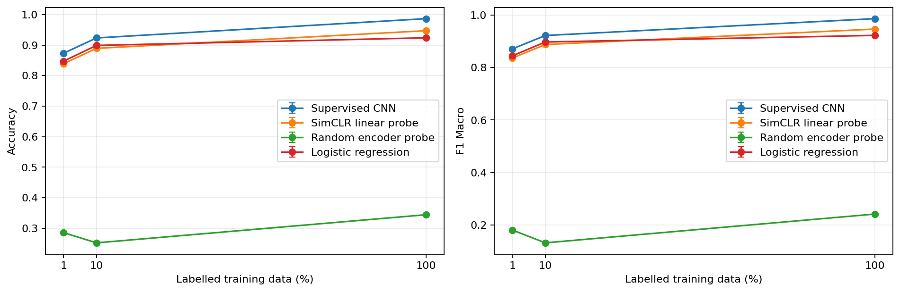
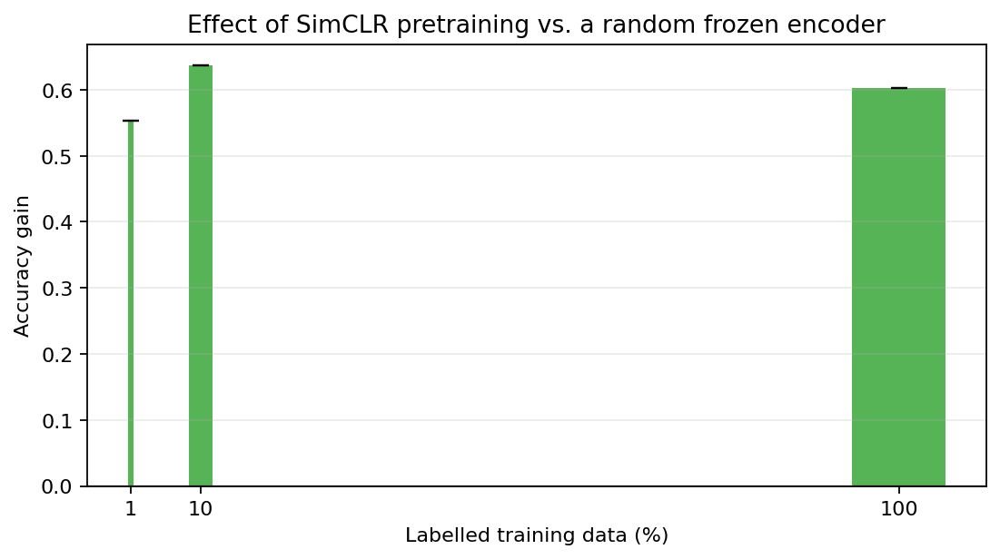
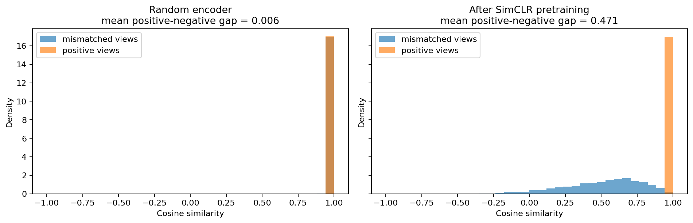

# Supervised and Contrastive Representation Learning on MNIST

## Introduction

Deep classifiers normally require labels, while self-supervised contrastive learning learns invariances from augmented views. This study tests whether a small SimCLR-style pretraining stage is useful when only 1%, 10%, or 100% of training labels are available. No direction of the result was assumed.

## Objectives

We compare (A) a compact supervised CNN, (B) the identical encoder pretrained without labels and evaluated by a frozen linear probe, and (C) multinomial logistic regression on normalized pixels. A frozen randomly initialized encoder plus the same linear probe is included as a representation-learning control. All methods receive identical labelled example IDs within each seed and budget.

## Theoretical Background

For supervised classification, cross-entropy minimizes $-\log p_\theta(y_i\mid x_i)$ and directly adjusts both representation and decision boundary toward the supplied class label. Contrastive pretraining instead makes two independently augmented views of each image. For an anchor $i$, its other view $j$ is the positive; the remaining $2N-2$ views in a batch are negatives. With normalized projections and temperature $\tau$, NT-Xent is

$$\ell_{i,j}=-\log\frac{\exp(\mathrm{sim}(z_i,z_j)/\tau)}{\sum_{k\ne i}\exp(\mathrm{sim}(z_i,z_k)/\tau)}.$$

An embedding space is useful when semantically related inputs admit a simple downstream boundary. The nonlinear projection head is used only to optimize the contrastive objective; the encoder representation beneath it is retained. A frozen linear probe then measures linear accessibility of digit identity without allowing the encoder to adapt. Thus a good representation and a good end classifier are related but distinct: the latter also depends on optimization, labels, and classifier capacity.

## Dataset

MNIST contains 28×28 grayscale images in ten digit classes. This run uses stratified, disjoint splits of 48,000 training, 12,000 validation, and 10,000 test examples. The test set is untouched until final evaluation. Labels in contrastive pretraining are used only to construct splits and labelled budgets; batches contain two images and no labels.

## Methodology

The CNN encoder uses three convolutional blocks and a 128-dimensional representation. The supervised model adds a ten-class layer. SimCLR adds a two-layer MLP projection head and optimizes NT-Xent ($\tau=0.5$) from two moderate affine/noise views, with no flips. Its encoder is frozen for linear probing. Logistic regression tunes $C\in\{0.1,1,10\}$ on validation data. The contrastive method has additional access to every unlabelled training image during pretraining, so labelled budgets are matched but compute and image exposure are not equivalent.

The random-encoder probe uses the same frozen architecture and identical probe optimization, isolating the effect of contrastive pretraining. Small labelled subsets use adaptive batch sizes and a minimum optimizer-update budget so that 1% and 10% conditions are not evaluated after only a handful of gradient steps.

## Experimental Setup

Mode: **full_reduced**. Seeds actually executed: **[42]**. AdamW is used for neural models. Early stopping and hyperparameter selection use validation data only; test predictions are computed after training decisions. Results aggregate 1 independently trained seeds: [42].

## Results

The table below is generated from the saved metrics; `n/a` standard deviations mean only one seed was run.

<!-- BEGIN GENERATED TABLE -->
| method               |   label_fraction |   accuracy |   precision_macro |   recall_macro |   f1_macro |
|:---------------------|-----------------:|-----------:|------------------:|---------------:|-----------:|
| Logistic regression  |           0.0100 |     0.8473 |            0.8467 |         0.8448 |     0.8449 |
| Logistic regression  |           0.1000 |     0.8989 |            0.8977 |         0.8975 |     0.8975 |
| Logistic regression  |           1.0000 |     0.9239 |            0.9230 |         0.9228 |     0.9228 |
| Random encoder probe |           0.0100 |     0.2854 |            0.1458 |         0.2714 |     0.1803 |
| Random encoder probe |           0.1000 |     0.2519 |            0.1038 |         0.2395 |     0.1314 |
| Random encoder probe |           1.0000 |     0.3440 |            0.4315 |         0.3324 |     0.2412 |
| SimCLR linear probe  |           0.0100 |     0.8390 |            0.8426 |         0.8371 |     0.8363 |
| SimCLR linear probe  |           0.1000 |     0.8893 |            0.8893 |         0.8882 |     0.8879 |
| SimCLR linear probe  |           1.0000 |     0.9471 |            0.9472 |         0.9465 |     0.9467 |
| Supervised CNN       |           0.0100 |     0.8733 |            0.8829 |         0.8729 |     0.8713 |
| Supervised CNN       |           0.1000 |     0.9234 |            0.9321 |         0.9226 |     0.9224 |
| Supervised CNN       |           1.0000 |     0.9866 |            0.9870 |         0.9864 |     0.9866 |
<!-- END GENERATED TABLE -->

Observed outcomes:

- At 1% labels, the highest observed mean test accuracy was 0.8733 (Supervised CNN). This is an observation, not proof of superiority.
- At 10% labels, the highest observed mean test accuracy was 0.9234 (Supervised CNN). This is an observation, not proof of superiority.
- At 100% labels, the highest observed mean test accuracy was 0.9866 (Supervised CNN). This is an observation, not proof of superiority.

Representation-learning control:

- At 1% labels, SimCLR minus the random-encoder probe was +0.5536 accuracy. This isolates the contribution of pretraining.
- At 10% labels, SimCLR minus the random-encoder probe was +0.6374 accuracy. This isolates the contribution of pretraining.
- At 100% labels, SimCLR minus the random-encoder probe was +0.6031 accuracy. This isolates the contribution of pretraining.

Across the executed seeds, the mean positive-minus-mismatched cosine gap was 0.0063 for the random encoder and 0.4711 after SimCLR.

Confusion matrices, PCA views, positive-versus-negative cosine distributions, and nearest-neighbor retrievals are stored under `outputs/full_reduced/figures`. Labels in PCA and retrieval titles are used only after training for interpretation.

## Discussion

Differences across label budgets should be interpreted jointly with the supervised validation curves, contrastive loss, cosine diagnostic, neighbor retrieval, confusion matrices, and PCA geometry. The large SimCLR-versus-random gains show that pretraining exposed linearly useful structure. SimCLR is already competitive with logistic regression at 1% and 10% labels and exceeds it at 100%, but the end-to-end supervised CNN remains best at every measured budget.

## Limitations

MNIST is small, grayscale, centred, and far simpler than natural imagery. NT-Xent is batch-size sensitive, and this reduced schedule may undertrain SimCLR. The run uses 1 seed, so it cannot quantify run-to-run uncertainty; even three seeds would provide limited statistical power. Labelled validation data and unequal compute/image exposure prevent interpreting this as a pure compute-matched comparison. Logistic convergence warnings, if present, should also be inspected.

## Conclusions

With 1% labels, the SimCLR probe reached 83.90%, compared with 28.54% for the identical frozen random encoder, 84.73% for logistic regression, and 87.33% for the end-to-end supervised CNN. SimCLR therefore gained 55.36 percentage points from pretraining while remaining 3.43 points below the CNN.

With all labels, SimCLR reached 94.71%, exceeding logistic regression by 2.32 points but remaining 3.95 points below the supervised CNN. These results strongly support that contrastive pretraining learned linearly useful digit structure, including in the low-label condition. They do not establish that SimCLR is the best classifier or that it generally reduces label requirements, because only 1 seed was executed with this schedule.

## References

Chen, T., Kornblith, S., Norouzi, M., & Hinton, G. (2020). *A Simple Framework for Contrastive Learning of Visual Representations*. Proceedings of the 37th ICML, PMLR 119, 1597–1607. https://proceedings.mlr.press/v119/chen20j.html

LeCun, Y., Cortes, C., & Burges, C. J. C. (1998). *The MNIST database of handwritten digits*. http://yann.lecun.com/exdb/mnist/
