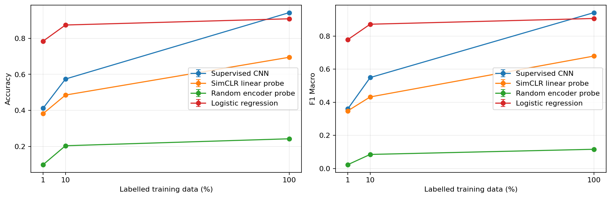
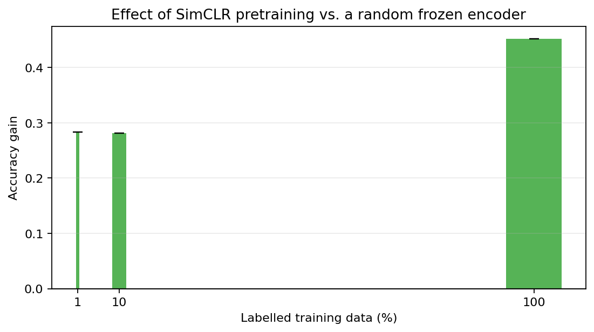
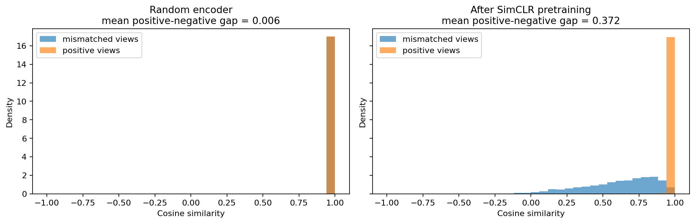

# Supervised and Contrastive Representation Learning on MNIST

## Introduction

Deep classifiers normally require labels, while self-supervised contrastive learning learns invariances from augmented views. This study tests whether a small SimCLR-style pretraining stage is useful when only 1%, 10%, or 100% of training labels are available. No direction of the result was assumed.

## Objectives

We compare (A) a compact supervised CNN, (B) the identical encoder pretrained without labels and evaluated by a frozen linear probe, and (C) multinomial logistic regression on normalized pixels. A frozen randomly initialized encoder plus the same linear probe is included as a representation-learning control. All methods receive identical labelled example IDs within each seed and budget.

## Theoretical Background

For supervised classification, cross-entropy minimizes $-\log p_\theta(y_i\mid x_i)$ and directly adjusts both representation and decision boundary toward the supplied class label. Contrastive pretraining instead makes two independently augmented views of each image. For an anchor $i$, its other view $j$ is the positive; the remaining $2N-2$ views in a batch are negatives. With normalized projections and temperature $\tau$, NT-Xent is

$$\ell_{i,j}=-\log\frac{\exp(\mathrm{sim}(z_i,z_j)/\tau)}{\sum_{k\ne i}\exp(\mathrm{sim}(z_i,z_k)/\tau)}.$$

An embedding space is useful when semantically related inputs admit a simple downstream boundary. The nonlinear projection head is used only to optimize the contrastive objective; the encoder representation beneath it is retained. A frozen linear probe then measures linear accessibility of digit identity without allowing the encoder to adapt. Thus a good representation and a good end classifier are related but distinct: the latter also depends on optimization, labels, and classifier capacity.

## Dataset

MNIST contains 28×28 grayscale images in ten digit classes. The quick protocol draws stratified, disjoint subsets of 12,000 training and 2,000 validation examples from the official training set and 2,000 examples from the official test set. The test set is untouched until final evaluation. Labels in contrastive pretraining are used only to construct splits and labelled budgets; batches contain two images and no labels.

## Methodology

The CNN encoder uses three convolutional blocks and a 128-dimensional representation. The supervised model adds a ten-class layer. SimCLR adds a two-layer MLP projection head and optimizes NT-Xent ($\tau=0.5$) from two moderate affine/noise views, with no flips. Its encoder is frozen for linear probing. Logistic regression tunes $C\in\{0.1,1,10\}$ on validation data. The contrastive method has additional access to every unlabelled training image during pretraining, so labelled budgets are matched but compute and image exposure are not equivalent.

The random-encoder probe uses the same frozen architecture and identical probe optimization, isolating the effect of contrastive pretraining. Small labelled subsets use adaptive batch sizes and a minimum optimizer-update budget so that 1% and 10% conditions are not evaluated after only a handful of gradient steps.

## Experimental Setup

Mode: **quick**. Seeds actually executed: **[42]**. AdamW is used for neural models. Early stopping and hyperparameter selection use validation data only; test predictions are computed after training decisions. This is a smoke-test run and must not be interpreted as a general empirical conclusion. The full three-seed experiment was not executed in the CPU-only development environment.

## Results

The table below is generated from the saved metrics; `n/a` standard deviations mean only one seed was run.

<!-- BEGIN GENERATED TABLE -->
| method               |   label_fraction |   accuracy |   precision_macro |   recall_macro |   f1_macro |
|:---------------------|-----------------:|-----------:|------------------:|---------------:|-----------:|
| Logistic regression  |           0.0100 |     0.7840 |            0.7859 |         0.7790 |     0.7786 |
| Logistic regression  |           0.1000 |     0.8735 |            0.8735 |         0.8715 |     0.8717 |
| Logistic regression  |           1.0000 |     0.9080 |            0.9071 |         0.9062 |     0.9063 |
| Random encoder probe |           0.0100 |     0.0990 |            0.0264 |         0.1031 |     0.0230 |
| Random encoder probe |           0.1000 |     0.2040 |            0.0595 |         0.1904 |     0.0849 |
| Random encoder probe |           1.0000 |     0.2425 |            0.0993 |         0.2304 |     0.1160 |
| SimCLR linear probe  |           0.0100 |     0.3820 |            0.3896 |         0.3744 |     0.3482 |
| SimCLR linear probe  |           0.1000 |     0.4850 |            0.5144 |         0.4761 |     0.4323 |
| SimCLR linear probe  |           1.0000 |     0.6945 |            0.6950 |         0.6872 |     0.6792 |
| Supervised CNN       |           0.0100 |     0.4120 |            0.5081 |         0.4038 |     0.3602 |
| Supervised CNN       |           0.1000 |     0.5740 |            0.6793 |         0.5636 |     0.5494 |
| Supervised CNN       |           1.0000 |     0.9420 |            0.9473 |         0.9412 |     0.9416 |
<!-- END GENERATED TABLE -->

Observed outcomes:

- At 1% labels, the highest observed mean test accuracy was 0.7840 (Logistic regression). This is an observation, not proof of superiority.
- At 10% labels, the highest observed mean test accuracy was 0.8735 (Logistic regression). This is an observation, not proof of superiority.
- At 100% labels, the highest observed mean test accuracy was 0.9420 (Supervised CNN). This is an observation, not proof of superiority.

Representation-learning control:

- At 1% labels, SimCLR minus the random-encoder probe was +0.2830 accuracy. This isolates the contribution of pretraining.
- At 10% labels, SimCLR minus the random-encoder probe was +0.2810 accuracy. This isolates the contribution of pretraining.
- At 100% labels, SimCLR minus the random-encoder probe was +0.4520 accuracy. This isolates the contribution of pretraining.

Across the executed seeds, the mean positive-minus-mismatched cosine gap was 0.0064 for the random encoder and 0.3719 after SimCLR.

Confusion matrices, PCA views, positive-versus-negative cosine distributions, and nearest-neighbor retrievals are stored under `outputs/quick/figures`. Labels in PCA and retrieval titles are used only after training for interpretation.

## Discussion

Differences across label budgets should be interpreted jointly with the supervised validation curves, contrastive loss, cosine diagnostic, neighbor retrieval, confusion matrices, and PCA geometry. A SimCLR probe above the identical random probe supports the claim that pretraining exposed linearly useful structure; it does not imply that the representation beats end-to-end supervision. A lower score would be evidence about this objective, augmentation policy, architecture, and training budget, not a general refutation of contrastive learning. The quick run is solely an integration check.

## Limitations

MNIST is small, grayscale, centred, and far simpler than natural imagery. NT-Xent is batch-size sensitive. The compact architecture and short schedule may undertrain SimCLR. Quick mode has one seed and cannot quantify run-to-run uncertainty; even three full-mode seeds provide limited statistical power. Labelled validation data and unequal compute/image exposure prevent interpreting this as a pure compute-matched comparison. Logistic convergence warnings, if present, should also be inspected.

## Conclusions

The saved results support only the budget-specific observations above. Claims about label efficiency require the full multi-seed experiment; theoretical expectations are not substituted for measurements.

## References

Chen, T., Kornblith, S., Norouzi, M., & Hinton, G. (2020). *A Simple Framework for Contrastive Learning of Visual Representations*. Proceedings of the 37th ICML, PMLR 119, 1597–1607. https://proceedings.mlr.press/v119/chen20j.html

LeCun, Y., Cortes, C., & Burges, C. J. C. (1998). *The MNIST database of handwritten digits*. http://yann.lecun.com/exdb/mnist/
